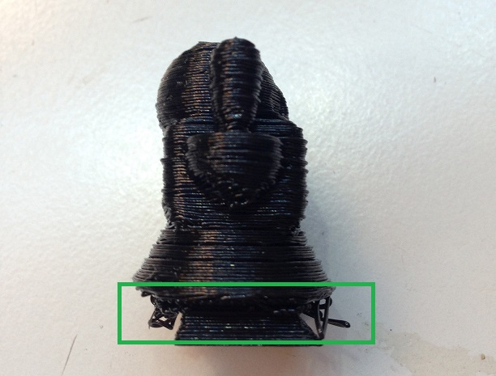
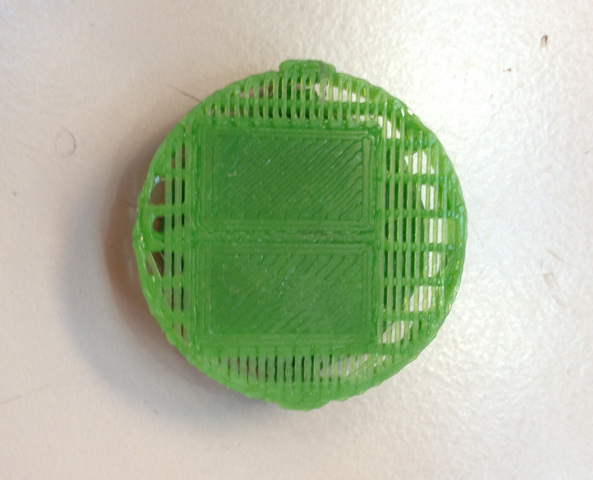

# 4.2 Voladizos (Overhang)

La impresora 3D necesita una base en la cual apoyar la impresión. Si se imprimen **piezas con salientes**, nos encontraremos con el problema de los voladizos, o de los hilos que cuelgan.

*Figura 15: Voladizos en una pieza impresa sin soporte.*

Para evitar este problema, existe una única solución, que es la **activación de un soporte** para nuestra pieza. Este soporte desechable estará constituido por el mismo material que la pieza y su función será la de servir como **base provisional** de impresión.

Se puede activar esta función desde la pestaña *Slicer*, marcando la casilla *Enable Support* y seguidamente haciendo click en *Slice con Slic3r*, para guardar los cambios.

Como se puede observar en la figura 16, en la cual se pausó la impresión, el soporte se suele imprimir de un modo **menos robusto** que el relleno, para facilitar su posterior eliminación con algún material cortante.

*Figura 16: Soporte lineal al rededor de dos piezas rectangulares.*

Para modificar los ajustes del relleno, se deben seguir las siguientes instrucciones:

*Slicer>Configure>PrintSettings>SupportMaterial*