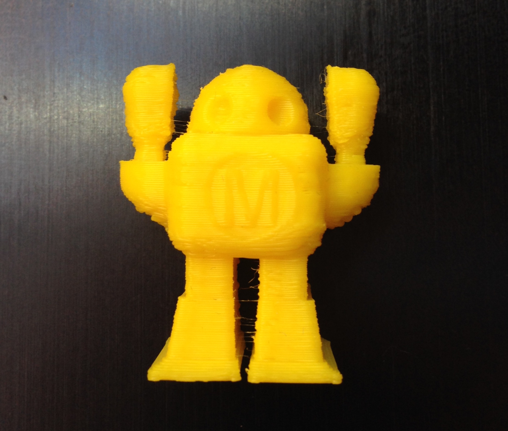

# 5.1 Hilos finos entre piezas (Hairy print)

La aparición de hilos muy finos en los espacios de nuestra pieza es un problema menor relacionado directamente con la **viscosidad** del filamento utilizado. El **PLA**, por ejemplo, es un plástico bastante viscoso, por lo que es muy probable que en piezas con espacios pequeños deje hilos como los que se pueden apreciar en la figura 12.

*Figura 12: Hilos entre los brazos y piernas del robot impreso.*

Estos hilos se pueden eliminar facilmente con cualquier **superficie cortante**. 

Si bien es complicado determinar como evitarlos mediante ajustes en el software de la impresora, siempre se recomienda **no** trabajar por encima de la **temperatura recomendada** para el material del filamento si queremos evitar problemas relacionados con excesos de material en nuestra pieza.

