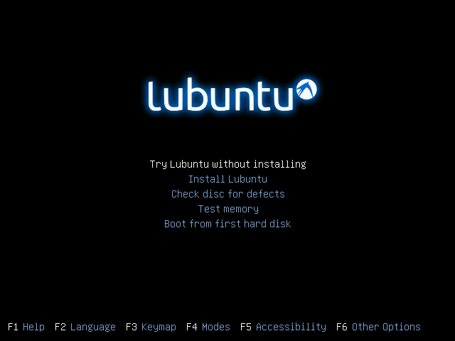
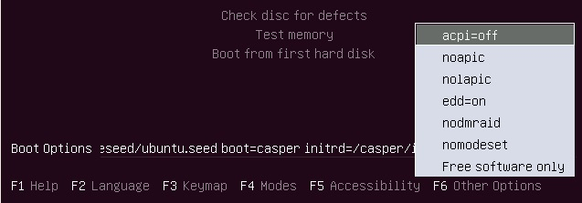

# ANEXO 1: Sistema operativo y sofware

Debido a un **cambio en los equipos** del laboratorio, se va a proceder a un **cambio en los sistemas operativos** y en el software de control de la impresora.

### 1- Sistema operativo *Lubuntu*
*Lubuntu* es un sistema operativo **rápido y ligero**, fundado por Julien Lavergne, cuyo núcleo está basado en *Linux* y *Ubuntu*. La ventaja competitiva de *Lubuntu* reside en su rapidez y su eficiencia energética, además de sus pocos requerimientos respecto a  hardware.

La elección de este sistema responde a dos motivos fundamentales:

* Es un sistema operativo de **software libre**, es decir, respeta la libertad de los usuarios. El desarrollo de este tipo de sistema operativo ha permitido que se pueda utilizar un ordenador sin software que sea limitante en cualquier aspecto.

* Al no disponer de equipos demasiado potentes en el laboratorio, nos conviene un sistema operativo que **no consuma demasiados recursos**, como es el caso de *Lubuntu*, que puede ser considerada la versión ligera de *Ubuntu*.

A la instalación del sistema se puede acceder desde este [enlace](https://help.ubuntu.com/community/Lubuntu/GetLubuntu). Se puede proceder a instalarlo desde un dispositivo USB booteable, haciendo uso de* [Unetbooting](https://unetbootin.github.io/)*, o desde un DVD.

En los equipos de la universidad hemos instalado **Lubuntu 14.04 de 64 bits***. Al iniciar nuestro PC desde el disco en el que tengamos nuestro sistema operativo, saldrá la siguiente imagen en pantalla.

*Figura 19: Installer de Lubuntu*

**Antes** de clicar *Install Lubuntu*, si vamos a trabajar con monitores antiguos, conviene pulsar *F6 Other Options* y cuando salga un desplegable como el que se muestra en la figura 20, elegir *nomodeset* pulsar **ESC** para poder **modificar el código** que sale seguido de *Boot Options*.

*Figura 20: Desplegable al pulsar F6*

En la linea de *Boot Options* **reemplazaremos** *quiet splash* por *vga=normal nomodeset*. Despues de esto procederemos a instalar Lubuntu en el equipo siguiendo las instrucciones del instalador.

### 2- Software *Cura*

Cura es un software libre de impresión que usaremos en el entorno de *Lubuntu*. Puede ser descargado desde [este](https://ultimaker.com/en/products/cura-software/list) repositorio.

Para su instalación, en este caso de la **versión 15.04.6 de 64 bits**, se deben seguir los siguientes pasos:

1. Abrir el terminal de Lubuntu y escribir *sudo apt-get update* para actualizar el listado de paquetes disponibles que pueden sernos necesarios para la instalación del sofware.

2. Escribiremos en el terminal *sudo apt-get install cura*, si la instalación no se completa correctamente porque se requiere la instalación de más paquetes (se nos enumerarán), procederemos a la instalación de estos paquetes en serie del siguiente modo: *sudo apt-get install nombrepaquete1 'et''et' sudo apt-get install nombrepaquete2 'et''et'*, etc, siendo 'et' el símbolo de la "y conjunción".

2. Una vez hayamos instalado *Cura*, se ejecute y arranque el instalador, comprobaremos en la pestaña de *Choose Components* que el software abre **archivos .stl y .obj**. Puede interesarnos marcar *Uninstall other Cura versions* si tenemos versiones anteriores instaladas en el ordenador.

3. Seguiremos los pasos que marca el instalador hasta que esta finalice. Cuando esto ocurra **no abriremos el programa** ya que primero hay que configurar el software.

4. Para poder imprimir necesitaremos tener permisos de administrador. Para ello, escribiremos en el terminal: *sudo chmod 777 /dev/ttyS0*.

---

*Dado que todo este manual de mantenimiento se explica desde el software Repetier-Host, se recomienda consultar el [manual de Cura](http://www.zonamaker.com/index.php/impresion-3d/software-imp3d/manual-de-cura) para conocer cómo acceder a los ajustes básicos a los que se hace referencia a lo largo de este documento.*

---

### 3- Software Repetier-Host

*Repetier-Host *es el software de impresión utilizado de forma exclusiva hasta el 2016 en las impresoras del Departamento de Robótica de la UC3M. Puede ser descargado desde [este](https://www.repetier.com/downloads/)  repositorio. En los equipos del laboratorio encontramos la versión **Repetier Host Linux 1.6.2**.

Para su instalación se deben seguir los siguientes pasos:

1. Desde la terminal de *Lubuntu*, escribir: *sudo .\configureFirst.sh* e instalar todos los paquetes que sean necesarios
2. Ejecutar *Repetier-Host*.
1. Seguir las indicaciones del instalador.
2. Marcar **todas** las casillas en la ventana de *Seleccione los Componentes*
3. Seguimos los pasos que marca el instalador hasta que esta finalice. Cuando esto ocurra **abriremos el programa** para configurarlo desde el botón *Configurar Impresora*.

---

*Para conocer los detalles de configuración del software Cura y Repetier Host, visite el ANEXO 2 de este manual.*

---

### 4- Configuración de Sesión de Invitado

Debido al elevado tráfico de usuarios, y por medidas de seguridad para un correcto funcionamiento, se requiere de la generación de una sesión de invitado, a partir de la cual se generará una configuración de forma temporal para permitir su autodestrucción al finalizar la experiencia de usuario.

Para llevar a cabo la configuración de la sesión de invitado los pasos a seguir serán los siguientes:

1. Inicio de sesión en modo Administrador.
2. Acceso al fichero de configuración a la generación de sesión de invitado a través de la ruta /usr/share/lib/lightdm/guest-session-auto.sh
3. Modificación del Script de generación de sesión de invitado facilitado en la ruta ( [Blacky](https://github.com/asrob-uc3m/impresoras-asrob/blob/master/Blacky/guest-session-auto.sh ), o bien ( [Hija Resurrection](https://github.com/asrob-uc3m/impresoras-asrob/blob/master/Hija%20Resurrection/guest-session-auto.sh),
con los siguientes parámetros:

-------------------------------------------------------------------------------------------------

`# run possible local startup commands`
`test -f /etc/guest-session/auto.sh && . /etc/guest-session/auto.sh`

`# cp -r /usr/share/asrob/RepetierHost ~/.local/share/`
`mkdir -p ~/.mono/registry/CurrentUser/software`
`cp -r /usr/share/asrob/repetier ~/.mono/registry/CurrentUser/software`
`cp -r /usr/share/asrob/.Slic3r ~/`

`#Disable auto-logout`
`export TMOUT=0`
`xset s 0 dpms 0 0 0`

----------------------------------------------------------------------------------------------------------

Como se puede observaren el Script:

Para funcionar, Repetier necesitará 3 carpetas: 

- `/home/asrob/.Slic3r` Es donde se guardan los perfiles de Slic3r: carpetas print, printer y filament.
- `/home/asrob/.mono/registry/CurrentUser/software/repetier` Es donde se guarda la configuración de Repetier, para que según se abra, todas las opciones aparezcan preseleccionadas.
-  `/home/asrob/.local/share/RepetierHost` Es donde se guarda la configuración de Cura, entre otras cosas. No hace falta para que funcione con Slic3r.

- El objetivo es que la primera vez que Repetier se ejecute en la sesión de invitado, esté totalmente preconfigurado, por lo que debemos generar la configuración deseada y guardarla para precargarla cada vez que se inicie una sesión de invitado nueva que, recordemos, se crea totalmente vacía.

Las carpetas anteriores deben copiarse a una intermedia a la que tenga acceso la cuenta de invitado. En nuestro caso estamos usando `/usr/share/asrob` . Esta carpeta es adecuada porque el invitado no tiene permisos de escritura, solamente se puede alterar desde la sesión de administrador y haciendo sudo.

- Para evitar conflictos con las rutas, deben eliminarse los siguientes campos de los siguientes archivos:

| Nombre del campo | Nombre del archivo | Ruta del archivo |
|---|---|---|
| `lastLoadGCodeFolder` | `values.xml` | `~/.mono/registry/CurrentUser/software/repetier` |
| `lastLoadModelFolder` | `values.xml` | `~/.mono/registry/CurrentUser/software/repetier` |
| `workdir` | `values.xml` | `~/.mono/registry/CurrentUser/software/repetier` |
| `soundTemperature` | `values.xml` | `~/.mono/registry/CurrentUser/software/repetier/window` |
| `soundSoundCommand` | `values.xml` | `~/.mono/registry/CurrentUser/software/repetier/window` |
| `fileHistory` | `values.xml` | `~/.mono/registry/CurrentUser/software/repetier/window` |
| `soundError` | `values.xml` | `~/.mono/registry/CurrentUser/software/repetier/window` |
| `soundPrintPaused` | `values.xml` | `~/.mono/registry/CurrentUser/software/repetier/window` |
| `soundPrintFinished` | `values.xml` | `~/.mono/registry/CurrentUser/software/repetier/window` |

- Todos estos valores tienen en común que son rutas a las que no tiene acceso la sesión de invitado. En caso de detectarse más casos, se deberían eliminar también. Repetier al detectar que faltan, los regenera con valores correctos en la primera ejecución.

- Todas las tareas descritas en el punto 2 deben automatizarse con un script que se tendría que ejecutar con sudo (para realizar las copias y modificaciones de los archivos).

Dichas carpetas deben copiarse a la carpeta local del invitado, mediante las siguientes instrucciones al final del script `guest-session-auto.sh`, que es el que crea la sesión de usuario y está localizado en `/usr/lib/lightdm` ; mediante el código:

 `# cp -r /usr/share/asrob/RepetierHost ~/.local/share/ #en principio solo para cura`
 `mkdir -p ~/.mono/registry/CurrentUser/software`
 `cp -r /usr/share/asrob/repetier ~/.mono/registry/CurrentUser/software`
 `cp -r /usr/share/asrob/.Slic3r ~/`

Por último, mediante la línea:

`xset s 0 dpms 0 0 0`

Se cancelará el auto-logout de la sesión de invitado, previniendo así pérdida de datos durante el uso de la sesión.
