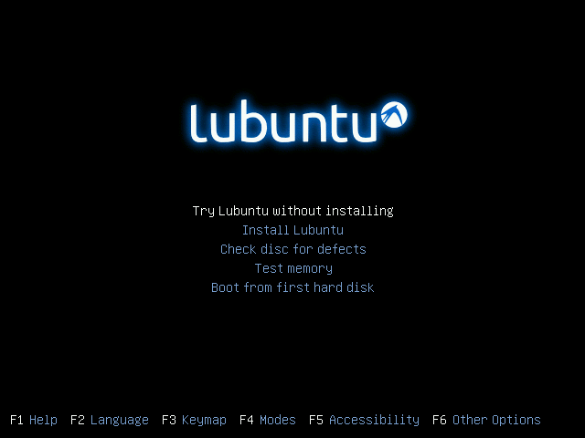

# ANEXO 1: Sistema operativo y sofware

Debido a un **cambio en los equipos** del laboratorio, se va a proceder a un **cambio en los sistemas operativos** y en el software de control de la impresora.

### 1- Sistema operativo *Lubuntu*
*Lubuntu* es un sistema operativo **rápido y ligero**, fundado por Julien Lavergne, cuyo núcleo está basado en *Linux* y *Ubuntu*. La ventaja competitiva de *Lubuntu* reside en su rapidez y su eficiencia energética, además de sus pocos requerimientos respecto a  hardware.

La elección de este sistema responde a dos motivos fundamentales:

* Es un sistema operativo de **software libre**, es decir, respeta la libertad de los usuarios. El desarrollo de este tipo de sistema operativo ha permitido que se pueda utilizar un ordenador sin software que sea limitante en cualquier aspecto.

* Al no disponer de equipos demasiado potentes en el laboratorio, nos conviene un sistema operativo que **no consuma demasiados recursos**, como es el caso de *Lubuntu*, que puede ser considerada la versión ligera de *Ubuntu*.

A la instalación del sistema se puede acceder desde este [enlace](http://lubuntu.net/). Se puede proceder a instalarlo desde un dispositivo USB booteable, haciendo uso de* [Unetbooting](https://unetbootin.github.io/)*, o desde un DVD.

Al iniciar nuestro PC desde el disco en el que tengamos nuestro sistema operativo, saldrá la siguiente imagen en pantalla.

*Figura 19: Installer de Lubuntu*

Antes de clicar *Install Lubuntu*, si vamos a trabajar con monitores antiguos, conviene pulsar *F6 Other Options* y cuando salga un desplegable como el que se muestra en la figura 20, pulsar ESC para poder modificar el código que sale seguido de *Boot Options*.

*Figura 20: Desplegable al pulsar F6*

En la linea de *Boot Options* reemplazaremos *quiet splash* por *vga=normal nomodeset*. Despues de esto procederemos a instalar Lubuntu en el equipo siguiendo las instrucciones del instalador.

---

Es probable que al instalar Lubuntu en equipos antiguos nos encontremos, a pesar del ajuste anterior, con el error típico de el monitor 'out of range' o fuera de rango cada vez que iniciemos el equipo, lo que nos impedirá entrar en el sistema con normalidad. Se ha encontrado una solución estable para este problema, para ello hay que seguir los siguientes pasos:

1. Mantener pulsado ESC mientras se inicia el equipo hasta que salgan varias opciones relacionadas con el arranque de Lubuntu.
2. Entrar al sistema operativo desde el modo *Recovery*, haciendo un *boot* normal.
3. Abrir el terminal de Lubuntu y escribir lo siguiente:
 1. ls 
 2. nano /etc/grub.d/10 linux
4. En el código que saldrá en pantalla a continuación, debemos encontrar las lineas que se muestran a continuación y comprobar que el codigo es idéntico a este. Lo que habremos de modificar será la parte en la que incluiremos el *vga=normal nomodeset \$vt_handoff*.

*Figura 21: Código terminal Lubuntu para solucionar problema de monitor fuera de rango*

Después de estos ajustes el problema no debería persistir, si persiste pongasé en contacto con el personal especializado.

---

 

### 2- Software *Cura*

Cura es un software libre de impresión que usaremos en el entorno de *Lubuntu*. Puede ser descargado desde [este](https://github.com/tumaker/Printing_software) repositorio.

Para su instalación se deben seguir los siguientes pasos:

1. Abrir el **archivo ejecutable** y seguir las instrucciones del asistente de instalación.
2. En la ventana de *Choose Components* aseguramos de que el softwarer abra **archivos .stl y .obj**. Puede interesarnos marcar *Uninstall other Cura versions* si tenemos versiones anteriores instaladas en el ordenador.
3. Seguimos los pasos que marca el instalador hasta que esta finalice. Cuando esto ocurra **no abriremos el programa** ya que primero hay que configurar el software.

---

*Dado que todo este manual de mantenimiento se explica desde el software Repetier-Host, se recomienda consultar el [manual de Cura](http://www.zonamaker.com/index.php/impresion-3d/software-imp3d/manual-de-cura) para conocer cómo acceder a los ajustes básicos a los que se hace referencia a lo largo de este documento.*

---

### 3- Software Repetier-Host

*Repetier-Host *es el software de impresión utilizado de forma exclusiva hasta el 2016 en las impresoras del Departamento de Robótica de la UC3M. Puede ser descargado desde [este](https://github.com/tumaker/Printing_software) repositorio.

Para su instalación se deben seguir los siguientes pasos:

1. Abrir el **archivo ejecutable** y seguir las indicaciones del instalador.
2. Marcar **todas** las casillas en la ventana de *Seleccione los Componentes*
3. Seguimos los pasos que marca el instalador hasta que esta finalice. Cuando esto ocurra **abriremos el programa** para configurarlo desde el botón *Configurar Impresora*.

---

*Para conocer los detalles de configuración del software Cura y Repetier Host, visite el ANEXO 2 de este manual.*

---

