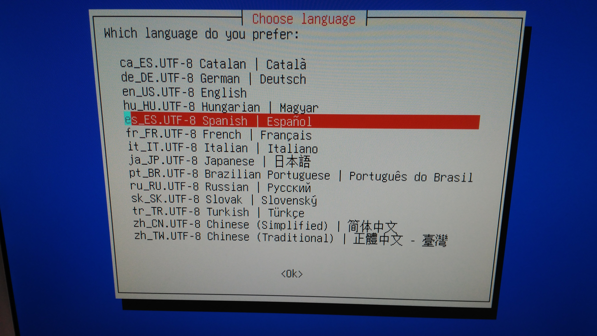

# ANEXO 3: Reinstalación de sistema operativo, software y configuraciones desde backup

Debido a un **cambio en uno de los equipos** del laboratorio, se va a proceder a un **cambio el sistema operativo** y en el software de control de la impresora.
Dado que el cambio de equipo llevado a cabo, ha sido la sustitución del equipo de control de Hija Resurection, por un equipo clon al de Blacky, con las misma especificaciones de Hardware, se ha llevado a cabo un clonado de disco duro con el fin de minimizar costes y tiempos.
Por lo tanto, las especificaciones de Hardware y Software de ambos equipos son idénticas.
Una vez realizado el check en ambos equipos, se ha procedido con un backup de seguridad en un único fichero, almacenando en el mismo, tanto el S.O, como el software instalado y configuraciones.
Por ello, en caso de suceder cualquier tipo de conflicto que no pueda ser resuelto con facilidad y se requiera un correcto funcionamiento del equipo en breve, se puede proceder con la reinstalación completa del equipo.

### 1- Herramientas de backup

Para llevar a cabo el proceso de restauración desde backup del sistema completo, se ha empleado la herramienta Clonezilla. Clonezilla es un software libre de recuperación ante desastres, sirve para la clonación de discos y particiones. Clonezilla está diseñado por Steven Shaiu y desarrollado por el NCHC Labs en Taiwán.
Durante el proceso de restauración backup, la versión empleada fué "stable - 2.5.2-31", sin embargo, para procesos posteriores de backup y/o restauración, puede emplearse la versión actual, dado que se trata de un sofware retrocompatible.
Clonezilla puede descargarse en caso de ser necesario desde el acceso ( [descargar](http://clonezilla.org/downloads.php) ). 

*Figura 1: Descarga de DVD Live Clonezilla*

### 2- Proceso de backup

Para poder llevar a cabo el proceso de restauración backup correctamente, las instrucciones recomendadas a seguir serán las siguientes:

1. Descarga de la imagen de la distro Live de Clonezilla desde el acceso ( [descargar](http://clonezilla.org/downloads.php) ). 
2. Descarge el backup de sistema operativo, con configuraciones y aplicaciones desde ( [aquí](https://drive.google.com/a/uc3m.es/file/d/0BwWZ4ZeHwSLXN21oZ0FjQjVBN2s/view?usp=sharing) ), y almacenelo en un dispotitivo externo.
NOTA:
Capacidad recomendada de al menos 3 GB, dado que el peso del backup es de aproximadamente 2-3 GB.
3. Quemado de la imagen en un dispositivo que permita un arranque posteriormente, tales como USB, CD o DVD ( Permite el arrque desde partición de disco, arranque de red y semejantes, sin embargo requerirá de preconfiguración adicional ).
NOTA:
Se recomienda grabación en CD o DVD, debido a problemas de reconocimiento de los dispositvos modernos.

4. Insertar el DVD o CD en el ordenador.
5. Arranque del ordenador desde la unidad de CDROM.
5. El sistema arrancará cargando el CD Live. Debido a la leve capacidad de cómputo del PC, es normal que tarde alrededor de 30-40 segundos hasta aparecer la primera selección.
7. Aparecerá el siguiente menú, seleccionar la opción por defecto Clonezilla Live.

*Figura 2: Arranque de DVD Live Clonezilla*

8. Tras la selección anterior arrancará el programa Live, tardando al rededor de otros 30 segundos, y elegiremos el idoma en cuestión, recomendando el Español, debido a la distribución del Teclado.

*Figura 3: Selección de idioma*

9. Seleccionamos no tocar el mapa de teclado.

*Figura 4: Configuración del teclado*

10. Iniciamos Clonezilla.

*Figura 5: Inicio*

11. Seleccionamos la primera opción dado que trabajaremos con imagenes de disco, discos y particiones.

*Figura 6: Proceso de backup*

12. Seleccionamos la primera opción dado que trabajaremos cen modo local.

*Figura 7: Proceso de backup*

13. Conectamos el dispositivo donde almacenar el backup o de donde restaurar, una vez se encuentre en la lista, ejecutar CTRL+C.

*Figura 8: Proceso de backup*

14. En este apartado, seleccionamos la unidad la cual almacena el backup.

*Figura 9: Proceso de backup*

15. Selecionamos la unidad donde esta almacenado, en este caso únicamente nos dirigimos a Done, para seleccionar toda la unidad.
NOTA:
La captura se realizó tras realizar el backup del PC de Hija Resurrection, y por ello la carpeta del dispositivo con el otro backup.

*Figura 10: Proceso de backup*

16. Seleccionamos el modo Beginner

*Figura 11: Proceso de backup*

17. Selecionamos la opción de restoredisk, dado que el proceso será restauración de copia de seguridad.

*Figura 12: Proceso de backup*

18. Selecionamos el disco en el cual restauraremos el backup.

*Figura 13: Proceso de backup*

19. Podemos omitir la comprobación y reparación del sistema de archivos de la fuente, o bien realizarlo. (A opción del ususario, no se recomienda la última opción por seguiridad)

*Figura 14: Proceso de backup*

20. Respecto a la imagen final es posible comprobar o no el resultado final. Es recomendable realizarlo por seguridad.

*Figura 15: Proceso de backup*

21. Selecionamos no cifrar la imagen.

*Figura 16: Proceso de backup*

22. Selecionamos la eleción una vez finalizado. ( A elección del usuario )

*Figura 17: Proceso de backup*

23. Una vez seleccionado, comenzará y pedirá una confimación por seguridad.Escribimos "y", acto seguido presionamos Intro.

*Figura 18: Proceso de backup*

24. Comenzará el proceso de cálculo.

*Figura 19: Proceso de backup*

25. Comenzará el proceso de restauración backup del sistema, con una duración aproximada de 7 minutos.

*Figura 20: Proceso de backup*

26. Una vez finalizado, se concluye el proceso de resturación de backup.

Para más información y proceso de backup, por favor consulte el ANEXO 4.

NOTA:

Adicional.

## Eliminar entradas residuales del menú de Grub

Si queremos que el menú de arranque de Grub aparezca más limpio (eliminar entradas repetidas del kernel o aquellas que no utilizamos) podemos hacerlo modificando el fichero: “/boot/grub/grub.cfg”, de forma que comentaremos el código de aquellas partes que corresponden a lineas que no queremos que aparezcan en el menú. ¡OJO! es muy importante realizar previamente una copia de este fichero, por si cometiésemos algún error en la modificación del mismo. Se recomienda comentar las lineas en vez de eliminarlas, por si tuviéramos que corregir alguna modificación.

*Figura 21: Ejemplo de grub de arranque*

Para más información, fuente ( [UC3M Robots](http://robots.uc3m.es/index.php/Tutorial:_C%C3%B3mo_restaurar_un_S.O_en_una_partici%C3%B3n_arrancable) ).
