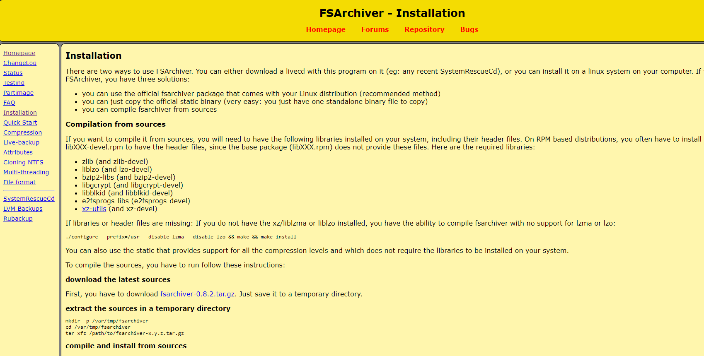
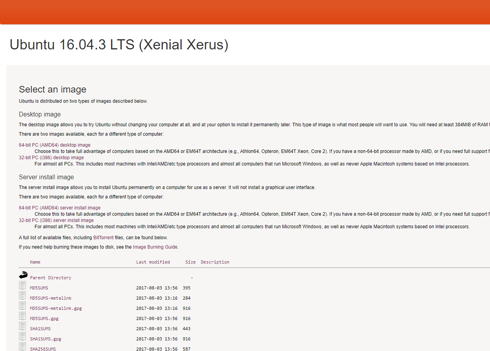

# ANEXO 4: Proceso de backup del Sistema Operativo, configuraciones y software

Con el fin de facilitar el proceso llevado a cabo para la realización del backup del s.o, configuraciones y software de los equipos del laboratorio de ASROB, se facilita el presente documento.

### 1- Herramientas de backup

Para el proceso de backup del sistema completo, se ha empleado la herramienta fsarchiver (fsa), la cual puede descargarse en caso de ser necesario desde el acceso ( [descargar](http://www.fsarchiver.org/) ). A su vez, puede ejecutarse desde una distro Live de Ubuntu Xenial o anterior, facilitada en el link ( [descargar](http://releases.ubuntu.com/16.04/) ).
Respecto al fichero backup a reinstalar, puede accederse en ( Pendiente ).

*Figura 1: fsarchiver*

### 2- Proceso de backup

(Pendiente).

*Figura 2: Ubuntu Xenial Live*
