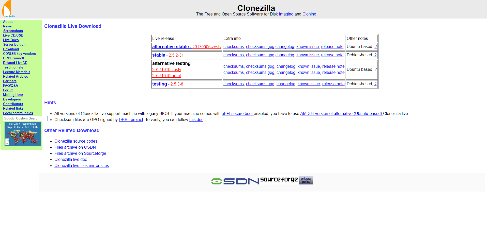

# ANEXO 4: Proceso de backup del Sistema Operativo, configuraciones y software

Con el fin de facilitar el proceso llevado a cabo para la realización del backup del s.o, configuraciones y software de los equipos del laboratorio de ASROB, se facilita el presente documento.

### 1- Herramientas de backup

Para llevar a cabo el proceso de backup del sistema completo, se ha empleado la herramienta Clonezilla. Clonezilla es un software libre de recuperación ante desastres, sirve para la clonación de discos y particiones. Clonezilla está diseñado por Steven Shaiu y desarrollado por el NCHC Labs en Taiwán.
Durante el proceso de backup, la versión empleada fué "stable - 2.5.2-31", sin embargo, para procesos posteriores de backup y/o restauración, puede emplearse la versión actual, dado que se trata de un sofware retrocompatible.
Clonezilla puede descargarse en caso de ser necesario desde el acceso ( [descargar](http://clonezilla.org/downloads.php) ). 

*Figura 1: Descarga de DVD Live Clonezilla*

### 2- Proceso de backup

(Pendiente).

*Figura 2: Ubuntu Xenial Live*

*Figura 3: Proceso de backup*
