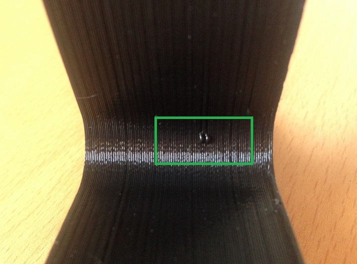

# Burbujas en la pieza

La aparición de excedentes de material en la superficie de la pieza se debe fundamentalmente a una temperatura excesiva del extrusor. Conviene disminuir gradualmente la temperatura de extrusión hasta encontrar aquella que no favorezca la apararición de estas imperfecciones (vease la figura 14).

*Figura 14: Burbujas en pieza impresa.*
