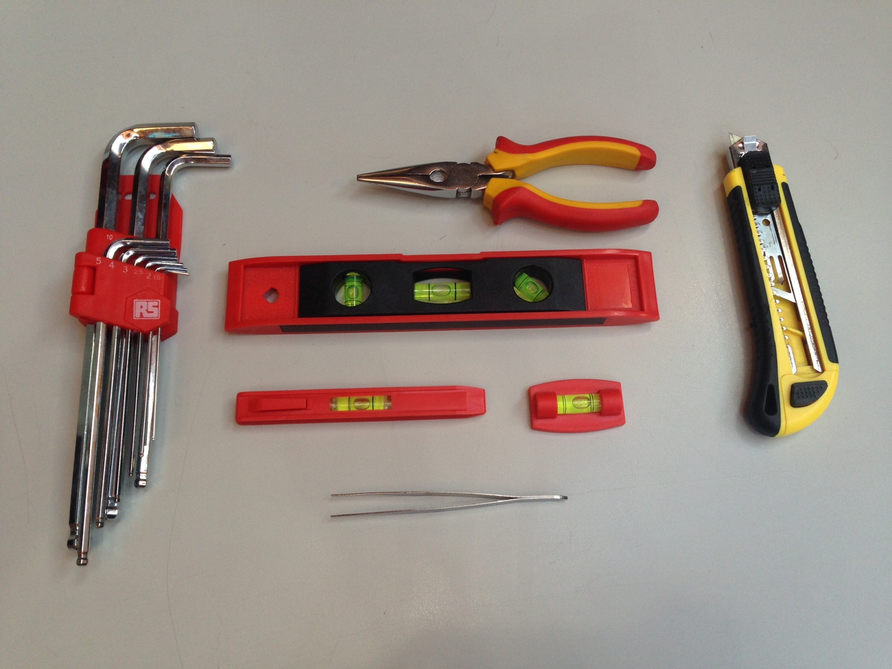

# Herramientas para el mantenimiento de las impresoras

De cara a la reparación de cualquier problema que pueda surgir en las impresoras 3D *Blacky* e *Hija Resurrection*, es conveniente reunir una serie de **herramientas** e instrumentos que nos serán útiles a la hora de **manipular** estos dispositivos.

* Soldador
* Estaño (cuanto más fino mejor)
* Alicates de corte (para cortar y pelar cables)
* Pinzas de punta fina
* Destornilladores planos y en cruz
* Llaves allen
* Llave inglesa o juego de llaves hexagonales
* Cable USB para conectar con la impresora (USB de PC a USB cuadrado. Necesario para el montaje y para el mantenimiento)

Es recomendable tener también:

* Soporte para soldar (para sujetar la electrónica mientras se suelda)
* Juego de limas, para ajustar algunos diámetros. (para los talleres se prestará el necesario)
* Pegamento Super Glue
* Pinta uñas o fija tuercas
* Laca (preferiblemente de marca Nelly)
* Kapton (en deshuso por la utilización de PLA)
* Tubo termoretractil
* Mechero
* Acetona (en deshuso por la utilización de PLA)

