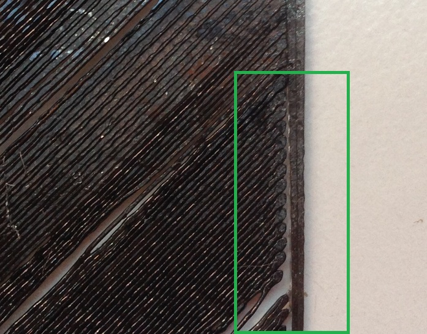

# Huecos entre el relleno y el perímetro

Existen dos situaciones posibles en las que podemos encontrar huecos entre el relleno y el perímetro. 

### 1- Hueco en toda la pieza entre el relleno y el perímetro

En este caso conviene revisar, como en la mayoría de ejemplos que podemos encontrar en este manual, que la velocidad de impresión no sea demasiado alta y que la temperatura de extrusión no sea demasiado baja.

En el caso de que estos ajustes no den un resultado positivo, podemos probar a modificar varios parámetro relacionados con el grosor de las paredes o el porcentaje de relleno. Se puede acceder a estos ajustes, respectivamente, siguiendo las siguientes instrucciones:

*Slicer>Configure>PrintSettings>LayersAndPerimeters*

*Slicer>Configure>PrintSettings>Infill*

Se recomienda tener siempre activada la siguiente casilla para evitar este problema:

*Slicer>PrintSettings>LayersAndPerimeters>DetectThinWalls*

### 2- Huecos en determinadas partes de la pieza entre el relleno y el perímetro

Si estos huecos se presentan de forma irregular, estamos ante un problema de subextrusión. Se recomienda revisar el apartado de este manual llamado *La impresora no suministra la cantidad de plástico necesaria (Subextrusión)*.

*Figura 14: Huecos irregulares entre el relleno y el perímetro. El problema se presenta como un claro caso de subextrusión, pues podemos comprobar que a lo largo de la base también se han producido espacios entre los filamentos.*

