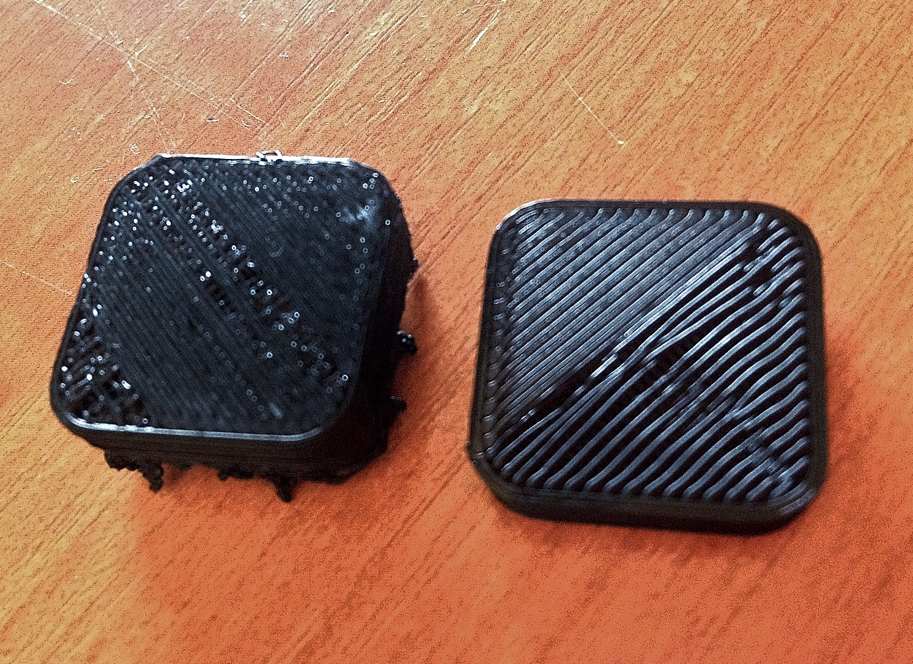
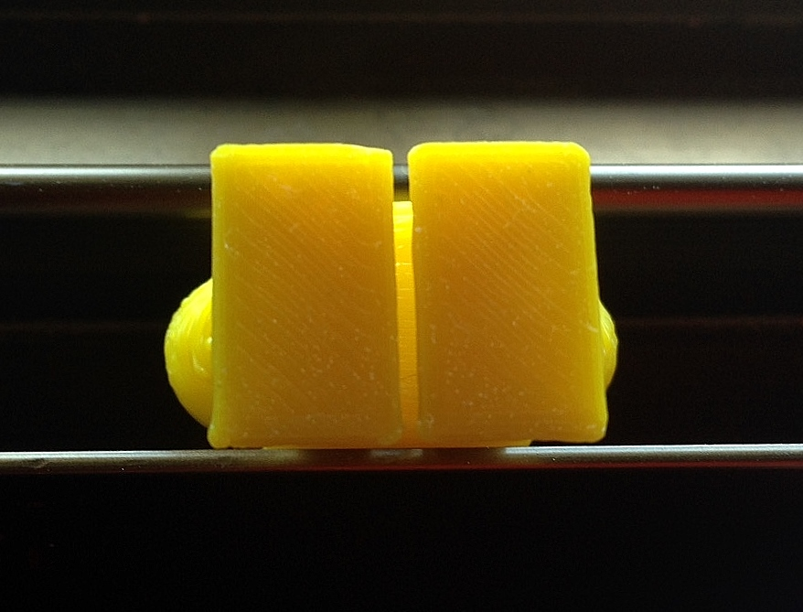

# La base de la pieza no se imprime uniforme

Si hay grietas o lineas muy visibles que incluso se levantan de la base en la capa inferior de nuestra pieza, tal y como ocurre en la figura 8, tendremos que revisar una serie de ajustes en nuestra impresora.

*Figura 8: Capa inferior no uniforme de pieza impresa con la impresora Blacky.*

### 1- Altura de la primera capa

Si la cama caliente está demasiado lejos de la boquilla del extrusor (Hot-end), el plástico no se aplastará bien sobre la base y la lineas quedarán separadas, luego no tendremos como resultado una superficie de aspecto homogéneo.

### 2- Temperatura de impresión

### 3- Aumentar o disminuir el ancho de linea en la primera capa

Una impresión correcta de la capa inferior sería la siguiente. Si no logra que su impresora realice una impresión correcta de la base de la pieza siguiendo las indicaciones anteriores, contacte con el personal de mantenimiento.

*Figura 9: Capa inferior uniforme de pieza impresa con la impresora Hija Revolution.*