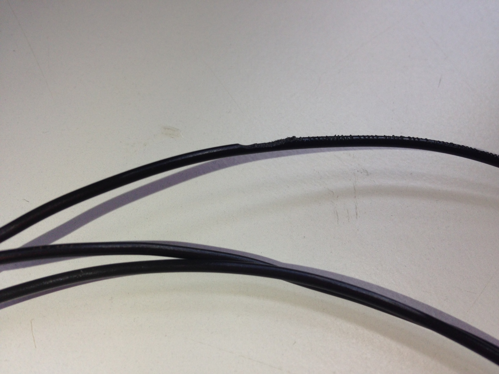

# La impresora no extruye filamento

La no extrusión de filamento es otro problema con numerosos posibles orígenes, se recomienda leer detenidamente la sección *La impresora no suministra la cantidad de plástico necesaria (Subextrusión)*, ya que la no extrusión de filamento **suele comenzar por** una **subextrusión** del material.

Los principales motivos directos de la no extrusión de filamento son los siguientes:

### 1- Obstrucción de la salida del extrusor

Al tratarse de un diámetro tan pequeño, la boquilla del extrusor puede **obstruirse facilmente**, bien por agentes externos como el polvo, o por el propio plástico, que puede haber dejado residuos por trabajarlo a una temperatura excesiva.

Se puede limpiar la salida del extrusor en **frío** o en **caliente**. Se recomienda probar primero en caliente, presionando ligeramente el filamento mientras extruimos el material. Si este método no resulta efectivo se puede proceder al método conocido como[* Atomic Method*](http://wiki.ikaslab.org/index.php/Mantenimiento#Desatascar_Hot-end:_Atomic_method), detallado en el anterior enlace.

Un método algo más arriesgado y **poco recomendado** por la posibilidad de dañar la boquilla es tratar de desatascar el extrusor usando algún objeto alargado y fino, como puede ser una aguja.

### 2- Filamento mordido

Este es uno de los problemas más comunes en la impresión 3D.

*Figura 5 - Filamento de PLA mordido.*

### 3- Distancia insuficiente entre la polea y el rodillo

*Figura 6 - Polea y rodillo separados.*

### 4- Enredos en el filamento

### 5- No queda filamento

Es recomendable comprobar que la cantidad de filamento previa a la impresión es la adecuada para las características de esta. Si el extrusor se queda sin filamento, habremos arruinado la pieza.

No se recomienda, igualmente, hacer cambios de filamento durante la impresión. Diríjase a la sección *Cambiar el filamento durante la impresión* para más información.

### 6- Motor sobrecalentado

Un motor sobrecalentado normalmente se detendrá por orden del controlador para evitar dañar el equipo o causar incendios, por lo tanto, al apagarse dejará de imprimir. Se recomienda revisar los ajustes del driver del motor para solucionar posibles problemas relacionados con el sobrecalentamiento de este.

### 7- Presión insuficiente

Es importante que el sistema de presión del extrusor esté bien ajustado o llegará un punto en el que deje de extruir el filamento. Se recomienda ponerse en contacto con el personal de mantenimiento especializado para calibrar este ajuste.