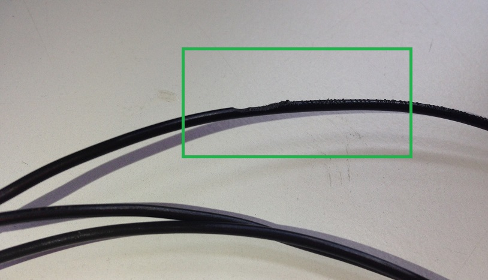

# La impresora no extruye filamento

La no extrusión de filamento es otro problema con numerosos posibles orígenes, se recomienda leer detenidamente la sección *La impresora no suministra la cantidad de plástico necesaria (Subextrusión)*, ya que la no extrusión de filamento **suele comenzar por** una **subextrusión** del material.

Los principales motivos directos de la no extrusión de filamento son los siguientes:

### 1- Obstrucción de la salida del extrusor

Al tratarse de un diámetro tan pequeño, la boquilla del extrusor puede **obstruirse facilmente**, bien por agentes externos como el polvo, o por el propio plástico, que puede haber dejado residuos por trabajarlo a una temperatura excesiva.

Se puede limpiar la salida del extrusor en **frío** o en **caliente**. Se recomienda probar primero en caliente, presionando ligeramente el filamento mientras extruimos el material. Si este método no resulta efectivo se puede proceder al método conocido como[* Atomic Method*](http://wiki.ikaslab.org/index.php/Mantenimiento#Desatascar_Hot-end:_Atomic_method), detallado en el anterior enlace.

Un método algo más arriesgado y **poco recomendado** por la posibilidad de dañar la boquilla es tratar de desatascar el extrusor usando algún objeto alargado y fino, como puede ser una aguja. Es más recomendable desmontar el extrusor y analizar la causa de la obstrusión con calma.

### 2- Filamento mordido

Este es uno de los problemas más comunes en la impresión 3D. La polea muerde el filamento durante la impresión y, como consecuencia, este no avanza.

*Figura 5: Filamento de PLA mordido.*

Si el cabezal no está obstruido, quitaremos el filamento pulsando el botón *Retraer* repetidas veces en la pestaña de *Control Manual* y cortaremos la parte mordida de este, ajustando correctamente a posteriori la tensión del muelle mediante las tuercas con orejas. Una de las principales causas de este problema puede ser, precisamente, que la **presión** que ejercen estos tornillos sea **insuficiente**.

Otros factores que debemos tener en cuenta para evitar la mordedura del filamento son:

1. **Velocidad**: Se recomienda evitar velocidades altas. Si se extruye más plástico del que el propio extrusor puede extraer, la polea terminará mordiendo el filamento, pues este encuentra dificultad en avanzar.
2. **Temperatura**: Si la temperatura no es la adecuada, al igual que en el caso anterior se pueden producir problemas de extrusión con la correspondiente mordida del filamento.
3. **Diámetro**: Un diámetro inferior al especificado puede producir que el filamento sea mordido.

Conviene revisar que la polea esté libre de residuos que le impidan trabajar conrrectamente. Para ello, desenrroscaremos los tornillos con los muelles que unen la polea al rodillo y, si fuera necesario, **limpiaremos** con algún **objeto fino** los espacios entre los dientes. Se recomienda comprobar que los dientes no estén desgastados.

*Figura 6: Polea y rodillo separados en la impresora Blacky.*

### 3- Enredos en el filamento

Es importante comprobar que los hilos no se solapan en el carrete, pues esto podría generar un nudo al tirar del filamento y podríamos atascar el extusor.

### 4- No queda filamento

Es recomendable comprobar que la **cantidad de filamento** previa a la impresión es la adecuada para las características de esta. Si el extrusor se queda sin filamento, habremos arruinado la pieza.

**No** se recomienda, igualmente, hacer cambios de filamento **durante** la impresión. Diríjase a la sección *Reemplazo de filamento durante la impresión* para más información.

### 5- Motor sobrecalentado

Un motor sobrecalentado normalmente se detendrá por orden del controlador para evitar dañar el equipo o causar incendios, por lo tanto, al apagarse dejará de imprimir. Se recomienda revisar los **ajustes del driver** del motor para solucionar posibles problemas relacionados con el sobrecalentamiento de este.

### 7- Presión insuficiente

Es importante que el sistema de presión del extrusor esté bien ajustado o llegará un punto en el que deje de extruir el filamento. Se recomienda ponerse en contacto con el **personal de mantenimiento** especializado para **calibrar** este ajuste correctamente.