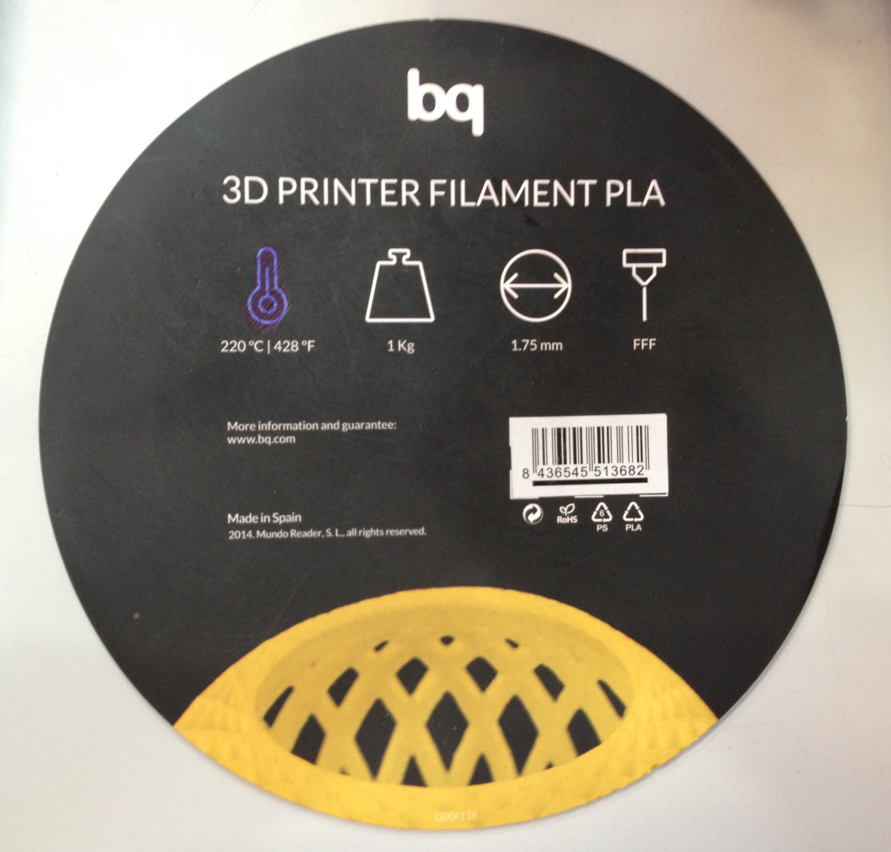

# La impresora no suministra la cantidad de plástico necesaria (subextrusión)

Si la impresora no suministra la cantidad de plástico necesaria para la impresión, conviene focalizar el origen de este problema. Puede deberse a varios motivos principales:

### 1- **Diámetro del filamento**

Debemos indicar a nuestro software *Repetier-Host*el **diámetro correcto** de nuestro filamento. En el caso de las impresoras Blacky e Hija Resurection, el diámetro recomendado para su buen funcionamiento es de **1,75 mm**. Indicar un valor erróneo de este parámetro podría producir problemas de extrusión.

### 2- **Material del filamento**

Cada plástico que se use va a exigir unas determinadas condiciones de impresión. En el caso de utilizar **ABS**, se debe tener en cuenta que es un plástico sensible a los cambios de temperatura y que generalmente las temperaturas de trabajo van a ser relativamente altas (Extrusor: 230ºC; Plataforma base: 120ºC), y la impresión por lo tanto va a ser más lenta. Por otra parte, en el caso de utilizar **PLA**, debemos tener en cuenta que necesita temperaturas de producción más bajas y que se trata de un plástico más estable ante los cambios de temperatura, por lo que podemos ejecutar una impresión más rápida sin afectar al buen funcionamiento de nuestro extrusor.

Se recomienda, por lo tanto, el uso de PLA sobre el de ABS en calidad de producción, mas se debe tener en cuenta la desventaja competitiva del primero sobre el segundo en referencia a postproducción, por tratarse este de un material frágil que no admite taladrado.

*Figura 1: 3D Printer Filament PLA utilizado en el Despartamento de Sistemas y Automática para estas impresoras.*

### 3- **Velocidad de la impresora**

