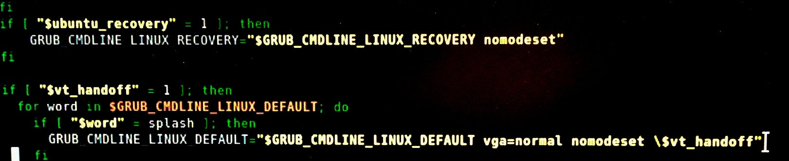

# Problemas relativos a la instalación de Lubuntu

La instalación del OS Lubuntu en ciertos equipos puede ocasionar problemas relacionados con el buen funcionamiento del monitor.

### 1- **Monitor fuera de rango**

Si aparece el mensaje **monitor 'out of range'** o " monitor fuera de rango" cada vez que se inicia el equipo, impidiéndonos entrar en el sistema con normalidad, se deberá proceder como se explica a continuación:

1. Mantener pulsado ESC mientras se inicia el equipo hasta que salgan varias opciones relacionadas con el arranque de Lubuntu.
2. Entrar al sistema operativo desde el modo *Recovery*, haciendo un *boot* normal.
3. Abrir el terminal de Lubuntu y escribir lo siguiente:
 1. ls 
 2. nano /etc/grub.d/10 linux
4. En el código que saldrá en pantalla a continuación, debemos encontrar las lineas que se muestran en la figura 21 y comprobar que el codigo es **idéntico** a este. Lo que habremos de modificar será la parte en la que incluiremos el *vga=normal nomodeset \$vt_handoff*.

*Figura 21: Código terminal Lubuntu para solucionar problema de monitor fuera de rango*

Después de estos ajustes el problema no debería persistir, si persiste pongasé en contacto con el personal especializado.

### 2- **Problemas de resolución del monitor**
