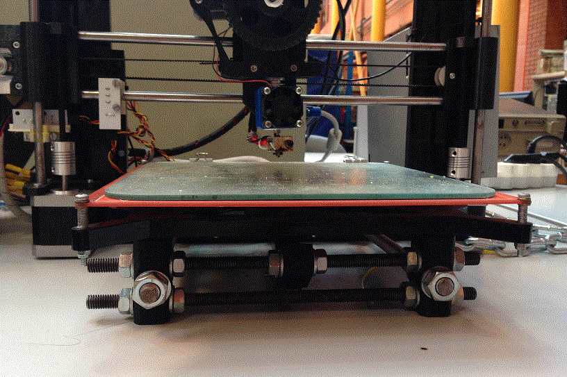
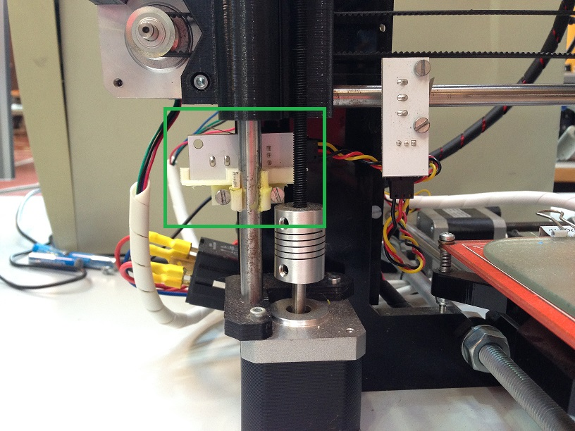

# Recomendaciones previas

Antes de proceder a la impresión de cualquier pieza, se recomienda seguir los siguientes pasos para evitar futuros problemas en el proceso de impresión.

### 1- **Purgar el cabezal del extrusor**

Si se va a utilizar la impresora 3D después de un periodo de reposo, habiendo calentado el hot-end, se recomienda extruir una pequeña cantidad de plástico antes de comenzar la impresión. Esto puede llevarse a cabo de dos maneras:

- **Mediante la pestaña de Control Manual: **

Pulsando un par de veces la flecha contigua al letrero *Extruir*, seleccionando una longitud de al menos 5 mm.

*Figura 1: Función de extrusión manual en el software Repetier-Host.*

- **Imprimiento un perímetro inicial exterior a la pieza (Skirt): **

Siguiendo la siguiente secuencia de operaciones podremos activar la ejecución de un perímetro externo a la pieza y previo a su impresión que servirá para evitar futuros problemas de subextrusión.

*Slicer>Configure>PrintSettings>SkirtAndBrim>Skirt*

En *Skirt* podremos determinar el número de vueltas (loops) de nuestro perímetro, la distancia al objeto, su altura y la longitud mínima de extrusión.

### 2- Calibrar el eje Z de la impresora

Se pueden seguir varios procedimientos para calibrar el eje Z de la impresora. Si partimos de una impresora con este eje no calibrado, tendremos numerosos problemas de impresión, bien por demasiada cercanía del extrusor a la cama caliente y su consecuente dificultad de extruir plástico, o bien por demasíada distancia entre estos, lo que produciría que el plástico se extruya a cierta altura y por lo tanto no se fije a la base caliente ni se consiga la forma esperada de la pieza. Se ha de tener en cuenta que **la distancia ideal entre el cabezal del extrusor y la base caliente es aquella que permita pasar un folio entre ambos sin dificultad.**

Los métodos recomendados para evitar este problema son:

- **Ajustar la altura de la base caliente mediante los cuatro tornillos que la fijan a la estructura de la impresora:**

Este es el modo más básico de calibrar el eje Z. Los tornillos son los verticales que se muestran en la siguiente figura.

*Figura 2: Cama caliente de la impresora 3D Blacky.*

- **Ajustar el final de carrera del eje Z:**

Ajustando el final de carrera del eje Z podemos aumentar o disminuir la distancia del extrusor a la base. Este final de carrera se ajusta en el sensor que puede encontrarse en el eje vertical de la impresora, tal y como se muestra a continuación.

*Figura 3: Sensor fin de carrera de la impresora 3D Blacky.*

- **Mediante la función Z offset**

Si se desea calibrar el eje Z de un modo **no manual**, siguiendo la siguiente secuencia de instrucciones se puede forzar a la impresora a que trabaje por encima o por debajo de su origen en el eje Z.

*Slicer>Configure>PrinterSettings>SizeAndCoordinates>Zoffset*

De este modo, eligiendo un número precedido de un guión (-) estaremos trabajandando por debajo del final de carrera del eje Z, dicha cantidad de milímetros. Por el contrario, sin el uso del guión, estaremos trabajando por encima de dicho límite.