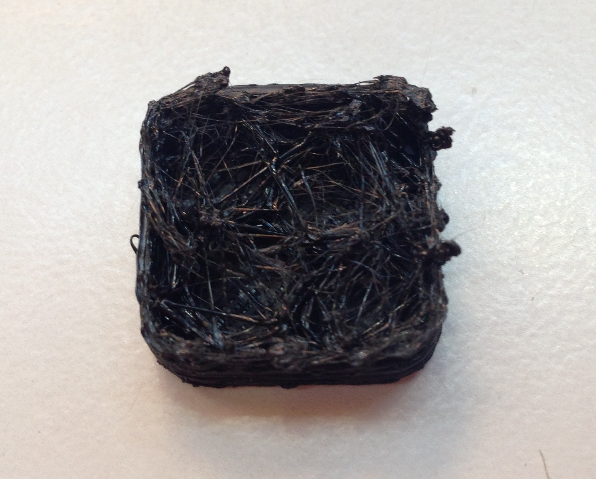

# Relleno defectuoso

Si el relleno de la pieza no se está imprimiendo correctamente, y se está obteniendo un resultado similar al de la figura 11, se deben revisar los siguientes parámetros de la impresora:

*Figura 11: Relleno Honeycomb defectuoso de pieza cúbica.*
### 1- Velocidad de impresión del relleno

Si la velocidad de impresión del relleno es muy **alta**, este probablemente no se imprimirá de forma correcta. Podemos modificar la velocidad de impresión del relleno siguiendo las siguientes instrucciones:

*Slicer>Configure>PrintSettings>Speed>SpeedForPrintMoves>Infill*

### 2- Aumentar el flujo de plástico

Para este y otros problemas relacionados con la **deficiencia** en la extrusión, consultar el apartado *La impresora no extruye suficiente filamento (Subextrusión)* de este manual.

### 3- Tipo de relleno

No todas las piezas ofrecen los mismos resultados antes los mismos tipos de relleno. El software Repetier-Host ofrece **7 tipos** diferentes de relleno. 

Usualmente se recomienda el relleno **Honeycomb** o relleno de panal de abeja, debido a las propiedades que este confiere a la pieza, pero se debe tener en cuenta que en piezas donde el relleno es muy estrecho, quizás nos convenga más utilizar otro tipo de relleno más adecuado, como el rectilineo.

---

Si nos encontramos en el caso particular de que nuestra pieza imprime huecos que no debería imprimir o, por el contrario, imprime capas en zonas donde debería imprimir huecos, debemos revisar el archivo de nuestra pieza, ya que probablemente esto esté ocurriendo porque el diseño de la pieza así lo determina.